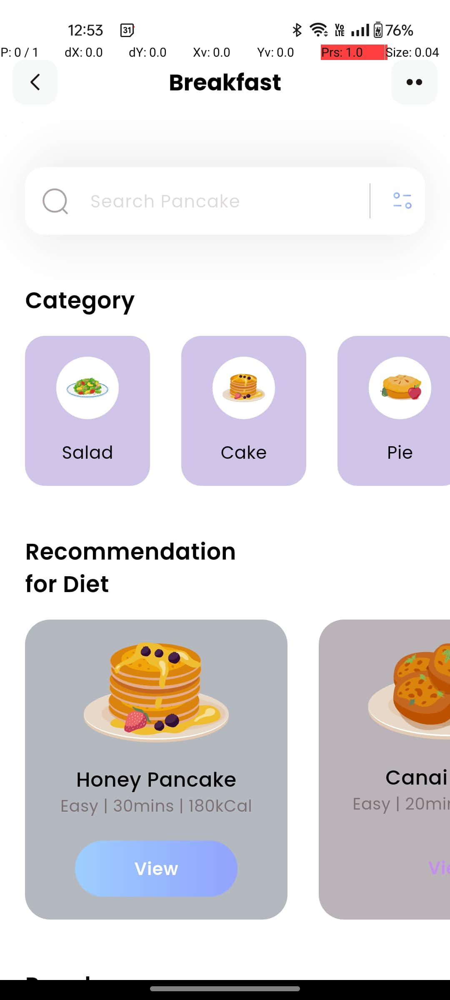

# 🥗 Basic Diet App

A simple front-end diet app built using **Flutter** that helps you stay on track with your meals by suggesting **what to eat** and **when to eat it**. This is a lightweight app designed for learning and prototyping — no backend, no database.

## 🚀 Features

- Basic meal schedule display (Breakfast, Lunch, Dinner, Snacks)
- Suggested foods for each meal
- Time-based meal suggestions using Flutter widgets
- Uses **BLoC (Business Logic Component)** for clean state management
- Clean and responsive UI

## 🛠️ Tech Stack

- **Flutter** – UI development
- **Dart** – Programming language
- **BLoC** – State management

## 📷 Screenshots

**


## 📁 Project Structure

```
diet_app/
├── lib/
│   ├── blocs/
│   ├── models/
│   ├── screens/
│   ├── widgets/
│   └── main.dart
├── pubspec.yaml
└── README.md
```

## 📌 How to Use

1. Make sure you have Flutter installed: https://flutter.dev/docs/get-started/install
2. Clone this repository
3. Run `flutter pub get` to install dependencies
4. Launch the app with `flutter run`

## 📝 Note

This is a front-end only project meant for demo or learning purposes. It doesn’t include user authentication, persistent data, or backend integration.

## 📄 License

This project is open-source and free to use under the MIT License.
